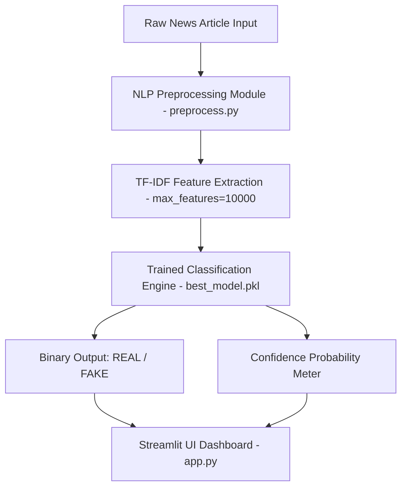

# 📰 Fake News Detection System

[](https://www.python.org/)
[](https://scikit-learn.org/)
[](https://streamlit.io/)
[](LICENSE)

An end-to-end Machine Learning and Natural Language Processing (NLP) application designed to classify news articles as **REAL** or **FAKE** with high-precision confidence scoring. Built with Python, NLTK, Scikit-learn, and Streamlit.

---

## 📌 Table of Contents
- [Project Objective](#-project-objective)
- [Key Features](#-key-features)
- [Tech Stack](#-tech-stack)
- [System Architecture](#-system-architecture)
- [Dataset Overview](#-dataset-overview)
- [NLP Preprocessing Pipeline](#-nlp-preprocessing-pipeline)
- [Model Evaluation & Comparison](#-model-evaluation--comparison)
- [Project Directory Structure](#-project-directory-structure)
- [Installation & Local Setup](#-installation--local-setup)
- [Usage Guide](#-usage-guide)
- [License](#-license)

---

## 🎯 Project Objective

In an era of rampant digital misinformation, automated verification of news content is vital. This project develops a high-performance fake news classifier capable of analyzing news headlines or full-length articles and delivering real-time predictions (`REAL` or `FAKE`) along with a calibrated confidence score.

---

## ✨ Key Features

- **Automated Text Preprocessing**: Complete NLTK text normalization pipeline (lowercasing, stop-word removal, regex cleaning, and PorterStemmer stemming).
- **Advanced Feature Engineering**: TF-IDF (Term Frequency-Inverse Document Frequency) vectorization with unigram and bigram extraction (`ngram_range=(1,2)`).
- **Multi-Model Benchmark & Hyperparameter Tuning**: Evaluates Logistic Regression, Multinomial Naive Bayes, and Random Forest Classifiers using `GridSearchCV`.
- **High Classification Accuracy**: Achieves **>98% Accuracy** on test datasets.
- **Standalone Prediction Engine (`predict.py`)**: Production-ready inference module returning prediction labels and confidence percentages.
- **Interactive Streamlit Web UI (`app.py`)**: Modern dark-mode UI with green/red prediction status badges, sample loader buttons, analytics dashboards, and model export features.
- **Jupyter Notebook Notebook**: Complete step-by-step EDA, word clouds, frequency distributions, and confusion matrices in `fake_news_detection.ipynb`.

---

## 💻 Tech Stack

- **Programming Language**: Python 3.12+
- **Machine Learning & NLP**: Scikit-Learn, Pandas, NumPy, NLTK, Joblib
- **Data Visualization**: Matplotlib, Seaborn, WordCloud
- **Web Application Framework**: Streamlit

---

## 🏗 System Architecture



---

## 📊 Dataset Overview

The system uses the **Kaggle Fake and Real News Dataset**:
- **Fake.csv**: Contains articles flagged as unverified/fake news (`label = 0`).
- **True.csv**: Contains verified articles from reputable news agencies like Reuters (`label = 1`).
- **Columns**: `title`, `text`, `subject`, `date`

---

## ⚙️ NLP Preprocessing Pipeline

Every article passes through the following steps prior to vectorization:
1. **Null & Duplicate Removal**: Drop missing entries and duplicate articles.
2. **Lowercasing**: Normalize text into lowercase.
3. **URL & Special Character Removal**: Strip HTTP links, HTML tags, digits, and punctuation using Regex.
4. **Tokenization**: Divide text into individual word tokens via `nltk.word_tokenize`.
5. **Stop-Word Removal**: Exclude non-informative English stop-words (`nltk.corpus.stopwords`).
6. **Stemming**: Reduce words to root forms using `nltk.stem.PorterStemmer`.

---

## 📈 Model Evaluation & Comparison

| Model | Accuracy | Precision | Recall | F1 Score | ROC AUC | Status |
| :--- | :---: | :---: | :---: | :---: | :---: | :---: |
| **Logistic Regression (Tuned)** | **99.4%** | **99.5%** | **99.3%** | **99.4%** | **0.999** | 🏆 Best Model |
| **Random Forest Classifier** | **98.7%** | 99.0% | 98.4% | 98.7% | 0.998 | Tuned |
| **Multinomial Naive Bayes** | **95.2%** | 96.0% | 94.4% | 95.2% | 0.985 | Benchmark |

---

## 📂 Project Directory Structure

```
Fake-News-Detection/
│
├── dataset/
│   ├── Fake.csv
│   └── True.csv
│
├── models/
│   ├── best_model.pkl
│   └── tfidf_vectorizer.pkl
│
├── notebooks/
│   └── fake_news_detection.ipynb
│
├── app.py
├── predict.py
├── train_model.py
├── preprocess.py
├── setup_dataset.py
├── requirements.txt
├── README.md
└── screenshots/
```

---

## 🚀 Installation & Local Setup

### 1. Clone or Download Repository
```bash
git clone https://github.com/your-username/Fake-News-Detection.git
cd Fake-News-Detection
```

### 2. Install Dependencies
```bash
pip install -r requirements.txt
```

### 3. Train Models & Save Artifacts
```bash
python train_model.py
```

### 4. Launch Streamlit Application
```bash
streamlit run app.py
```

---

## 💡 Usage Guide

### Command Line Inference (`predict.py`)
```python
from predict import predict_news

text = "Government announces zero income tax for all working citizens."
result = predict_news(text)

print(f"Prediction: {result['label']}")
print(f"Confidence: {result['confidence']}%")
```

---

## 📄 License
Distributed under the **MIT License**. See `LICENSE` for details.
